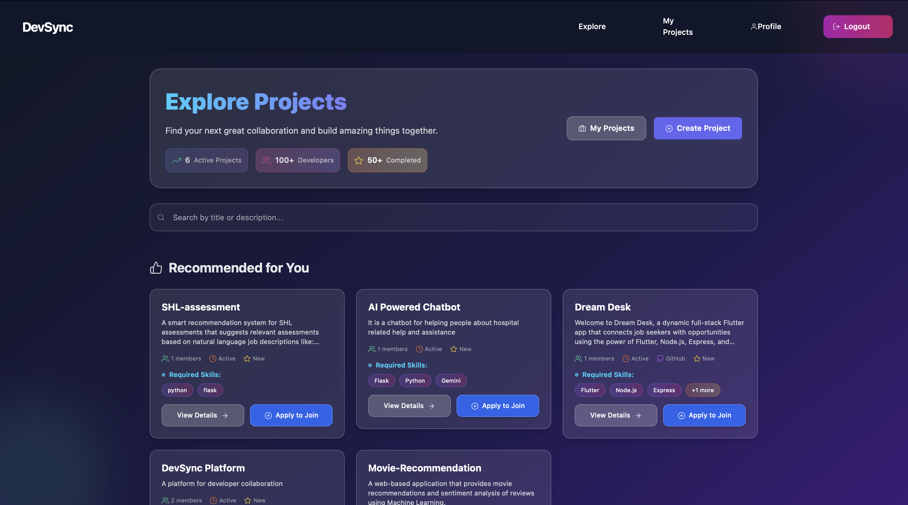
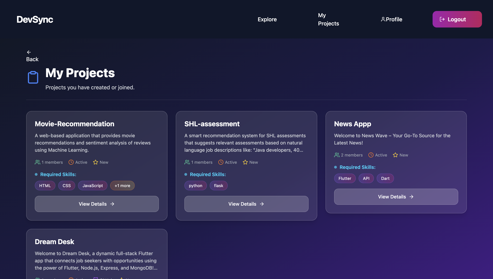
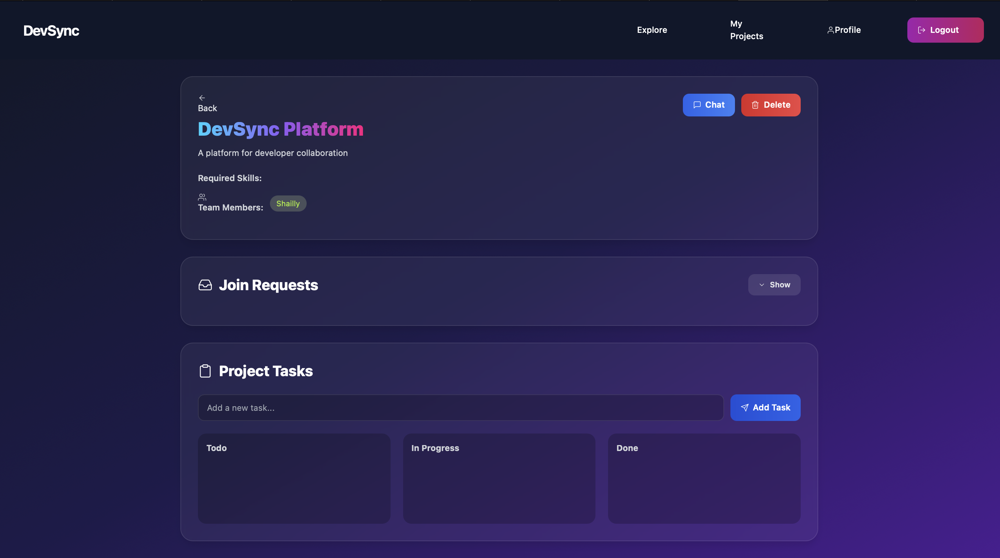
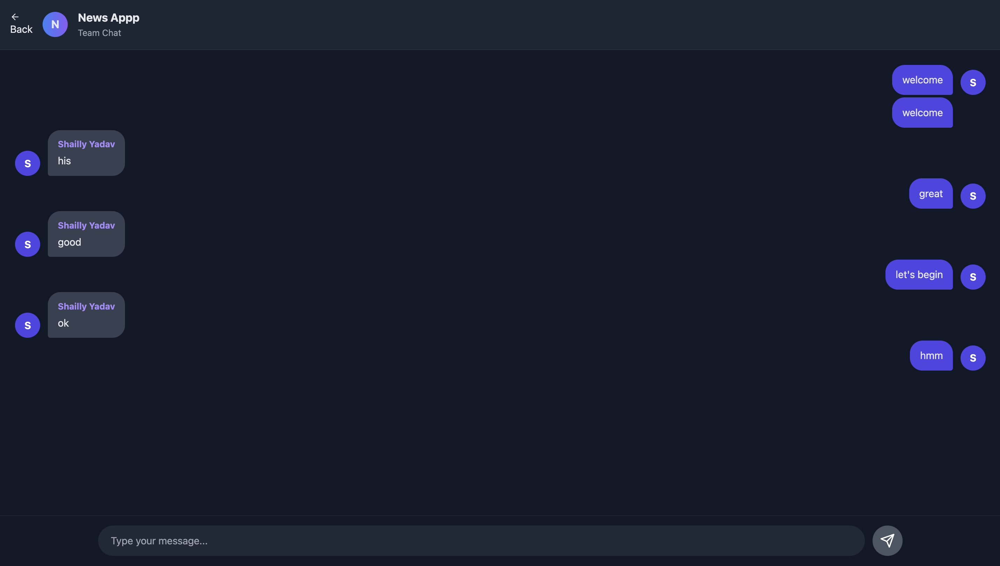
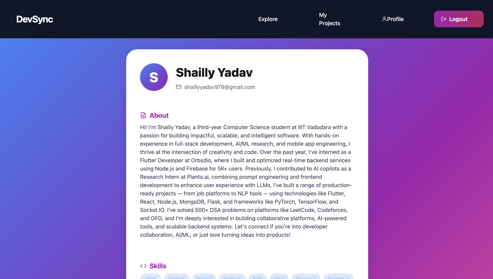
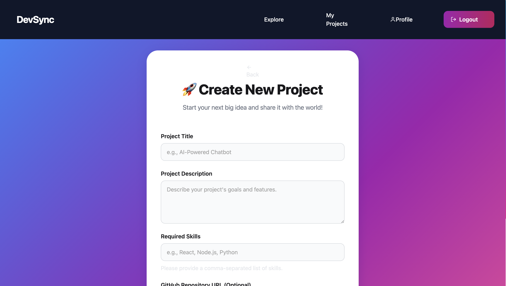

# DevSync Frontend

This is the frontend for DevSync, a modern web application designed to help developers connect, collaborate, and build projects together. It is built with React and Vite, providing a fast, responsive, and feature-rich user experience.

## ✨ Features
- **Modern & Responsive UI:** A sleek, intuitive interface built with a focus on usability, designed to work beautifully on all devices.
- **User Authentication:** Seamless login and registration flows, including email/password and Google OAuth.
- **AI-Powered Dashboard:** A personalized dashboard that welcomes users and provides AI-driven project recommendations based on their skills.
- **Project Exploration:** A dedicated page to explore all public projects, with search and filtering capabilities.
- **Full Project Management:** Users can create new projects, edit existing ones, and manage project details like required skills and GitHub links.
- **Interactive Project Pages:** Detailed project views featuring a Kanban-style task board, a list of team members, and an integrated real-time chat.
- **Real-time Chat:** Project-specific chat rooms powered by Socket.IO for instant team communication.
- **Editable User Profiles:** Users can fully customize their profiles, adding a bio, a list of skills, and links to their GitHub and personal portfolios.
- **Application System:** A clear and simple process for users to apply to join projects.

## 🛠 Tech Stack
- **React** for building the user interface.
- **Vite** as the fast build tool and development server.
- **React Router** for client-side routing.
- **Axios** for making API requests to the backend.
- **Socket.IO Client** for real-time WebSocket communication.
- **CSS Modules & Tailwind CSS** for component-level and utility-first styling.
- **React Icons** for a comprehensive set of icons.

## 🚀 Setup
1. Clone the repo.
2. Navigate to the frontend directory:
   ```bash
   cd DevSync-frontend/DevSync
   ```
3. Install dependencies:
   ```bash
   npm install
   ```
4. Create a `.env` file and set the `VITE_API_BASE_URL` to point to your running backend server (e.g., `VITE_API_BASE_URL=http://localhost:5001/api`).
5. Start the development server:
   ```bash
   npm run dev
   ```

## 📸 Screenshots

Below are some visuals from the project:









---
Connecting developers, one project at a time.
